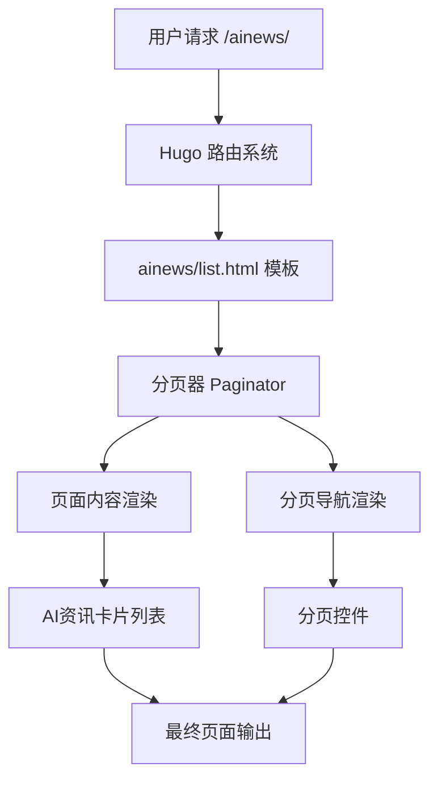
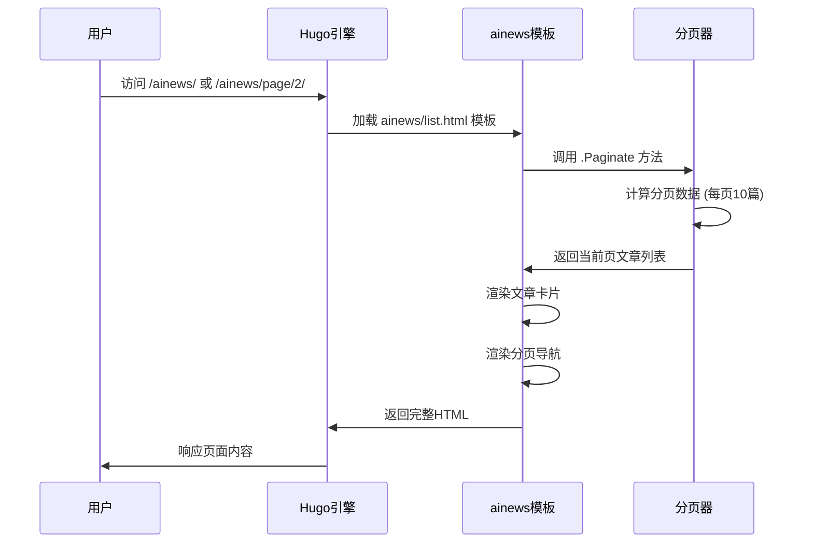

# Design Document

## Overview

本设计文档描述了为 BubbleBrain 博客的 AI 资讯页面添加分页功能的技术实现方案。通过分析现有的 Hugo 配置和 PaperMod 主题结构，我们发现项目已经具备了基础的分页支持，但 AI 资讯页面的自定义模板需要进行优化以提供更好的分页体验。

当前状态分析：
- Hugo 全局配置中已设置 `pagination.pagerSize: 10`
- 存在自定义的 `layouts/ainews/list.html` 模板
- 该模板已实现基础分页功能，但用户体验和样式需要改进

## Architecture

### 系统架构图



### 分页流程



## Components and Interfaces

### 1. 分页配置组件

**位置**: `hugo.yaml`
**功能**: 全局分页配置
**接口**:
```yaml
pagination:
  pagerSize: 10  # 每页文章数量
```

### 2. AI资讯列表模板

**位置**: `layouts/ainews/list.html`
**功能**: 渲染 AI 资讯列表页面和分页导航
**主要接口**:
- `.RegularPages` - 获取所有常规页面
- `.Paginate $pages` - 创建分页器
- `$paginator.Pages` - 当前页面的文章列表
- `$paginator.HasPrev/HasNext` - 分页导航状态
- `$paginator.Prev.URL/Next.URL` - 分页链接

### 3. 分页导航组件

**功能**: 提供用户友好的分页导航界面
**组件结构**:
```html
<footer class="page-footer">
  <nav class="pagination">
    <!-- 上一页链接 -->
    <a class="prev" href="...">« 上一页</a>
    
    <!-- 页码信息 -->
    <span class="page-info">第 X 页 / 共 Y 页</span>
    
    <!-- 下一页链接 -->
    <a class="next" href="...">下一页 »</a>
  </nav>
</footer>
```

### 4. CSS 样式组件

**位置**: `assets/css/extended/custom.css`
**功能**: 分页导航的样式定义
**主要样式类**:
- `.pagination` - 分页容器
- `.pagination .prev/.next` - 分页按钮
- `.pagination .page-info` - 页码信息
- `.pagination .disabled` - 禁用状态

## Data Models

### 分页数据模型

```go
type Paginator struct {
    PageNumber    int      // 当前页码 (1-based)
    TotalPages    int      // 总页数
    TotalElements int      // 总文章数
    Pages         []Page   // 当前页的文章列表
    HasPrev       bool     // 是否有上一页
    HasNext       bool     // 是否有下一页
    Prev          *Pager   // 上一页信息
    Next          *Pager   // 下一页信息
}

type Pager struct {
    URL string  // 页面URL
}
```

### AI资讯文章模型

```go
type AiNewsPage struct {
    Title       string    // 文章标题
    Date        time.Time // 发布日期
    Content     string    // 文章内容
    Summary     string    // 文章摘要
    Permalink   string    // 文章链接
    Description string    // 文章描述
}
```

## Error Handling

### 1. 页码超出范围处理

**场景**: 用户访问不存在的页码 (如 /ainews/page/999/)
**处理方式**: Hugo 自动重定向到有效页面或返回 404

### 2. 空内容处理

**场景**: AI 资讯目录下没有文章
**处理方式**: 显示友好的空状态提示

```html
{{- if eq (len $paginator.Pages) 0 }}
<div class="empty-state">
  <p>暂无 AI 资讯内容</p>
</div>
{{- end }}
```

### 3. 配置错误处理

**场景**: 分页配置无效 (如 pagerSize < 1)
**处理方式**: Hugo 使用默认值，确保系统正常运行

## Testing Strategy

### 1. 功能测试

**测试场景**:
- 验证每页显示 10 篇文章
- 验证分页导航正确显示
- 验证页码跳转功能
- 验证边界情况 (第一页/最后一页)

**测试方法**:
```bash
# 启动本地服务器
hugo server -D

# 访问测试页面
# /ainews/ - 第一页
# /ainews/page/2/ - 第二页
# /ainews/page/999/ - 无效页码
```

### 2. 响应式测试

**测试设备**:
- 桌面端 (1920x1080)
- 平板端 (768x1024)
- 移动端 (375x667)

**测试要点**:
- 分页导航在不同屏幕尺寸下的显示效果
- 触摸设备上的可用性

### 3. 主题兼容性测试

**测试场景**:
- 明亮主题下的分页样式
- 暗黑主题下的分页样式
- 主题切换时的样式过渡

### 4. SEO 测试

**验证要点**:
- 分页页面的 URL 结构正确
- meta 标签设置合理
- sitemap.xml 包含分页页面

### 5. 性能测试

**测试指标**:
- 页面加载时间
- 首屏渲染时间
- 分页导航响应速度

**测试工具**:
- Chrome DevTools
- Lighthouse
- Hugo 内置性能分析

## Implementation Notes

### 1. Hugo 分页机制

Hugo 的分页功能基于 `.Paginate` 方法，自动处理：
- URL 路由 (`/ainews/page/2/`)
- 页面计算和数据分片
- SEO 友好的 URL 生成

### 2. 模板继承

AI 资讯页面模板继承 PaperMod 主题的分页样式，确保：
- 视觉一致性
- 主题兼容性
- 维护便利性

### 3. 国际化支持

使用 Hugo 的 i18n 功能支持多语言：
```html
{{ i18n "prev_page" }} <!-- 上一页 -->
{{ i18n "next_page" }} <!-- 下一页 -->
```

### 4. 缓存优化

Hugo 静态生成的特性确保：
- 分页页面预生成，加载速度快
- CDN 友好的静态资源
- 无需服务器端分页计算